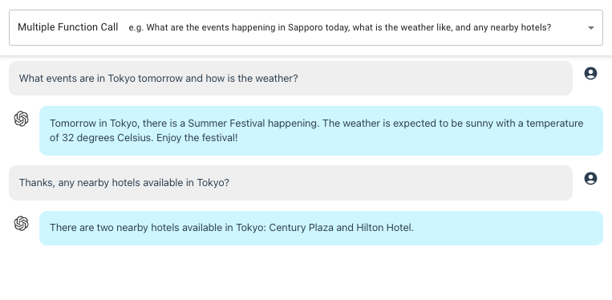
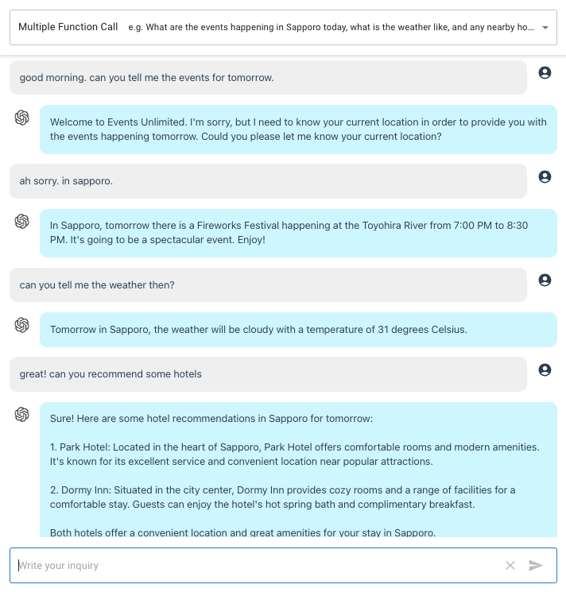

openai-api-function-call-sample
======

A sample app to demonstrate the newly added [function calling capabilities](https://openai.com/blog/function-calling-and-other-api-updates) in OpenAI Chat Completions API.

This application is built using manual setup of Next.js 13.

---

OpenAI Chat Completions APIで新たに追加された「ファンクションコール」機能を示すサンプルアプリ。

**Updates:**

* 2023-06-19: [Added Multi-Function Calling](#mutiple-function-call)

# Screenshot


# Function Call 

Following the sample given in the [announcement page](https://openai.com/blog/function-calling-and-other-api-updates),
in this demo, we are simulating a **customer service chatbot for a supermarket**.

The `function call` will pertain to getting the price for product `get_product_price`:

```javascript
{
  "name": "get_product_price",
  "description": "Get the product price given the product and quantity",
  "parameters": {
    "type": "object",
    "properties": {
      "product": {
        "type": "array",
        "description": "The product names, e.g. Campbell's soup",
        "items": {
          "type": "string"
        }
      },
      "quantity": {
        "type": "array",
        "description": "The quantity, e.g. 1, 5, 37, 129",
        "items": {
          "type": "integer"
        }
      },
      "unit": {
          "type": "array",
          "description": "The unit, e.g. pcs, kg, bottle, bag, packs",
          "items": {
              "type": "string"
          }
      }
    },
    "required": ["product"]
  }
}
```

> Note: Updated array output based from [this post](https://community.openai.com/t/function-call-arrays-as-parameters/268008/2).


A sample response if inquiry from the user invokes the function:

```javascript
{
  role: 'assistant',
  content: null,
  function_call: {
    name: 'get_product_price',
    arguments: '{\n' +
      '  "product": ["brown rice", "pork belly", "garlic", "vinegar", "soy sauce"],\n' +
      '  "quantity": [2, 1, 3, 1, 1],\n' +
      '  "unit": ["kg", "kg", "heads", "bottle", "bottle"]\n' +
      '}'
  }
}
```


Otherwise, the response is like this:

```javascript
{
  role: 'assistant',
  content: 'Welcome to Super Supermarket! How can I assist you today?'
}
```

In this demo, I do not call any external API or function but just mock the step.

From `/api/route.js`

```javascript
// Mock Call function API here
//const price = 1 + Math.round(100 * Math.random())
//console.log('price', price)

const args = JSON.parse(result.function_call.arguments) // supports array

let func_result = args.product.map((a) => {
  return {
    name: a,
    price: 1 + Math.round(100 * Math.random()) // just mock
  }
})
```

will result to:

```javascript

console.log(func_result)

// '[{"name":"brown rice","price":4},{"name":"pork belly","price":4},{"name":"garlic","price":5},{"name":"vinegar","price":22},{"name":"soy sauce","price":50}]'
```

From the given [sample in OpenAI's page](https://openai.com/blog/function-calling-and-other-api-updates),
we need to add the previous function call return plus the API return value to the `messages` array:

```javascript

// previous step
let messages = [
    { role: 'system', content: system },
]

messages = messages.concat(prev_data)
messages.push({ role: 'user', content: inquiry })

// first chat completion call
...

// add function call return
messages.push(result)

// add function API return
//messages.push({"role": "function", "name": "get_product_price", "content": JSON.stringify({ price })})

messages.push({"role": "function", "name": "get_product_price", "content": JSON.stringify(func_result)})
```

The expected result after this step is just simple response:

```javascript
{
  role: 'assistant',
  content: '...'
}
```

# Thinking Out Loud

Since sending too much data to the API cost money, I wonder what is the best way to implement `function call`.

In this demo, in the first API call, we do not know if the user inquiry will invoke `function call` so we are sending the system prompt and the previous conversation. If it does not contain `function call`, then we just pay a small price for the `function call` part.

However, if it does contain `function call`, then we send everything back again plus some more (function call and external API/function result). So, you can see that we double the tokens consumed.

The question is, would it be better to just check for `function call` first, without sending `previous conversations` and `system prompt`? If it failed, we just have the penalty of calling for the `function definition`. Is this approach better?


# Mutiple Function Call



> Please note that this is just a sample. There is probably better implementation out there to achieve multiple-function calling.


See `api2/route.js` for reference.

Function definition

```javascript
{
  "name": "get_user_inquiry",
  "description": "Get users inquiry",
  "parameters": {
      "type": "object",
      "properties": {
          "location": {
              "type": "string",
              "description": "The city, place or any location" //, e.g. San Francisco, CA - removing to prevent hallucination
          },
          "date": {
              "type": "string",
              "description": "The date, e.g. 2023-06-19, today, tomorrow"
          },
          "operation": {
              "type": "array",
              "description": "Topic of inquiry, e.g. weather, event, hotels",
              "enum": ["weather", "event", "hotels"],
              "items": {
                  "type": "string"
              }
          }
      },
      "required": ["location", "date"]
  }
}
```

Sample response with multi-function

```javascript
{
  role: 'assistant',
  content: null,
  function_call: {
    name: 'get_user_inquiry',
    arguments: '{\n' +
      '  "location": "Tokyo",\n' +
      '  "date": "tomorrow",\n' +
      '  "operation": ["event", "weather"]\n' +
      '}'
  }
}
```

Sample response with single-function

```javascript
{
  role: 'assistant',
  content: null,
  function_call: {
    name: 'get_user_inquiry',
    arguments: '{\n  "location": "Tokyo",\n  "operation": ["hotels"]\n}'
  }
}
```

The Mock API return will be

```javascript
{
  event: 'Summer Festival, Yoyogi Park, 13:00PM - 21:00PM',
  weather: '25 degrees celsius Cloudy',
  location: 'Tokyo',
  date: 'tomorrow'
}
```

In the [OpenAI cookbook sample code](https://github.com/openai/openai-cookbook/blob/main/examples/How_to_call_functions_with_chat_models.ipynb), a `system prompt` is added to restrict the `function call` not to hallucinate when required parameters were not included. However, from my testing, I find not having such prompt seem better (of course, ymmv). To illustrate:

User prompt:

```
I want to know any upcoming events in Sapporo this Friday.
```

> Note: I asked this question on Tuesday, 2023-06-20

With `system prompt`:

```javascript
{
  role: 'assistant',
  content: null,
  function_call: {
    name: 'get_user_inquiry',
    arguments: '{\n' +
      '  "location": "Sapporo",\n' +
      '  "date": "this friday",\n' + 
      '  "operation": ["event"]\n' +
      '}'
  }
}
```

Without `system prompt`:

```javascript
{
  role: 'assistant',
  content: null,
  function_call: {
    name: 'get_user_inquiry',
    arguments: '{\n' +
      '  "location": "Sapporo",\n' +
      '  "date": "2023-06-23",\n' +
      '  "operation": ["event"]\n' +
      '}'
  }
}
```

> **Known Bug**: If you ask for anything without specifying the `location`, it might default to `San Francisco, CA`.

## Persistent Parameters

Consider this conversation,

```
User: What is happening in Sapporo tomorrow?

ChatGPT: The Summer festival will begin tomorrow at Odori Park.

User: How is the weather then?
```

A possible `function call` response will be,

```javascript
{
  role: 'assistant',
  content: null,
  function_call: {
    name: 'get_user_inquiry',
    arguments: '{\n  "location": "here",\n  "date": "today",\n  "operation": ["weather"]\n}'
  }
}
```

Depending on how you phrase the last inquiry, you'll either get a similar result above with wrong parameters, blank parameters or worst, `San Francisco, CA`, the sample we gave in the description.

One way to handle this is to store the previous parameters we received in some session variables.
In Next.js, I will be using [cookie](https://nextjs.org/docs/app/api-reference/functions/cookies).

```javascript
const cookieStore = cookies()

// retrieve stored parameters
const session_var = cookieStore.get('session-var')

...

// store the parameters
cookieStore.set('session-var', JSON.stringify({
    location,
    date,
}))
```

So before I send the parameters to the external API/function, I validate the parameters we received from function call and substitute the values from the stored parameters, if necessary.

Now, when we try the conversation again,

```
User: What is happening in Sapporo tomorrow?

ChatGPT: The Summer festival will begin tomorrow at Odori Park.

User: How is the weather then?

ChatGPT: Tomorrow in Sapporo, the weather is expected to be sunny with a temperature of around 23 degrees Celsius. It should be a pleasant day to enjoy outdoor events like the Summer Festival.
```

Here is another sample conversation:




# Setup

Clone the repository and install the dependencies

```sh
git clone https://github.com/supershaneski/openai-api-function-call-sample.git myproject

cd myproject

npm install
```

Copy `.env.example` and rename it to `.env` then edit the `OPENAI_API_KEY` and use your own `OpenAI API key`.

```javascript
OPENAI_API_KEY=YOUR-OPENAI-API-KEY
```

Then run the app

```sh
npm run dev
```

Open your browser to `http://localhost:4000/` to load the application page.
