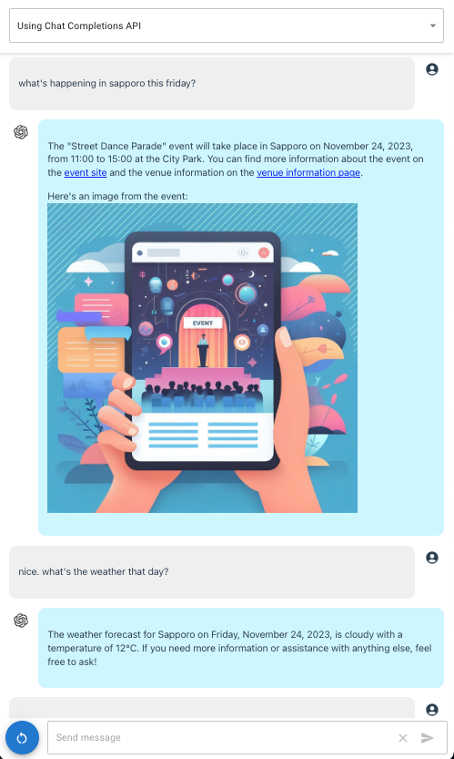
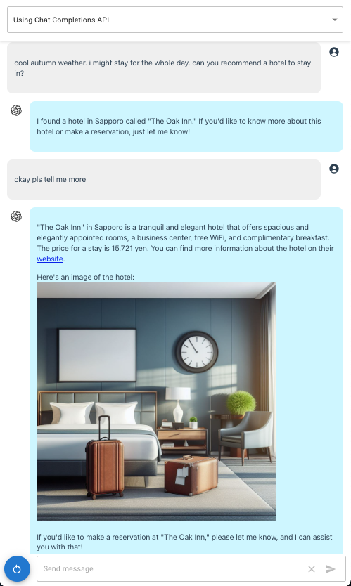
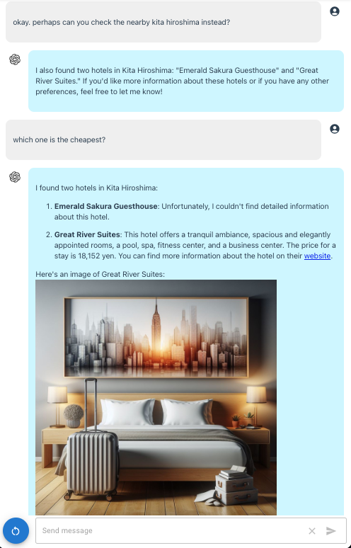
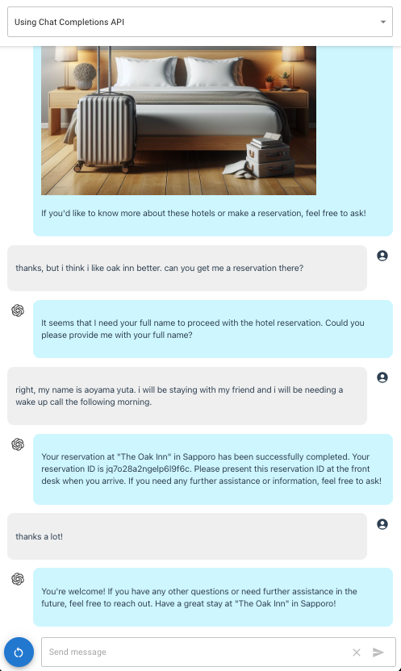
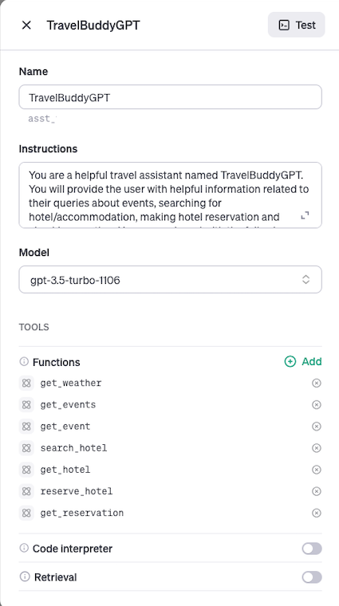
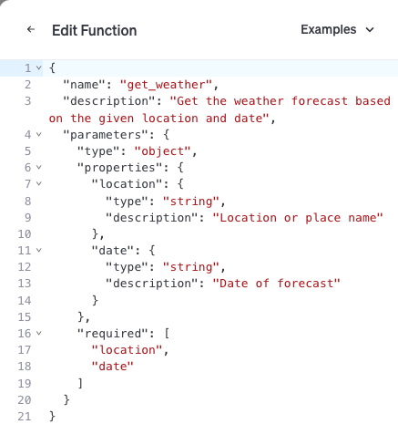

openai-api-function-call-sample
======

v0.0.2

A sample app to demonstrate [Function calling](https://platform.openai.com/docs/guides/function-calling) using the latest format in [Chat Completions API](https://platform.openai.com/docs/guides/text-generation/chat-completions-api) and also in [Assistants API](https://platform.openai.com/docs/assistants/overview).

This application is built using manual setup of Next.js 13.

---

最新のフォーマットを使用した[Chat Completions API](https://platform.openai.com/docs/guides/text-generation/chat-completions-api)および[Assistants API](https://platform.openai.com/docs/assistants/overview)での「[function calling](https://platform.openai.com/docs/guides/function-calling)」をデモンストレーションするサンプルアプリケーション。

このアプリケーションはNext.js 13の手動セットアップを使用して構築されています。


**Updated**: Using [v4.18.0 OpenAI Node module](https://www.npmjs.com/package/openai)


# Function Calling

We will be using `gpt-3.5-turbo-1106`. You can also replace it with `gpt-4-1106-preview` by editing the [service/openai.js](/service/openai.js) file.

To make better function calling, you need to take care of 4 things:
* system prompt
* writing the functions
* better handling of function output
* API call loop

## System Prompt

Even though function calling can be executed without the addition of a system prompt, my experience suggests that it is better to have one. It is like the icing on a cake. In this sample application, we’ve included a simple system prompt to facilitate operations.

```javascript
const system_prompt = `You are a helpful personal assistant.\n\n` +
    `# Tools\n` +
    `You have the following tools that you can invoke based on the user inquiry.\n` +
    `- get_weather, when the user wants to know the weather forecast given a location and date.\n` +
    `- get_events, when the user wants to know events happening in a given location and date.\n` +
    `- get_event, when the user wants to know more about a particular event.\n` +
    `- search_hotel, when the user wants to search for hotel based on given location.\n` +
    `- get_hotel, when the user wants to know more about a particular hotel.\n` +
    `- reserve_hotel, when the user wants to make room reservation for a particular hotel.\n` +
    `- get_reservation, when the user wants to get the details of their reservation.\n` +
    `When the user is making hotel reservation, be sure to guide the user to fill up all required information.\n` +
    `When you fill up some of the required information yourself, be sure to confirm to user before proceeding.\n` +
    `Aside from the listed functions above, answer all other inquiries by telling the user that it is out of scope of your ability.\n\n` +
    `# User\n` +
    `If my full name is needed, please ask me for my full name.\n\n` +
    `# Language Support\n` +
    `Please reply in the language used by the user.\n\n` +
    `Today is ${today}`
```

Here, we have enumerated the available tools/functions and provided guidelines on when they should be invoked. We have also included additional instructions on how to manage certain functions and other general directives. Given that we’re dealing with events, it’s necessary to append the current date.

## Functions/Tools

For this sample app, we have the following functions:
* get_weather(location, date)
* get_events(location, date)
* get_event(location, date, event)
* search_hotel(location)
* get_hotel(location, hotel)
* reserve_hotel(hotel, location, fullName, numberOfGuests, checkInDate, checkOutDate, roomType, specialRequests)
* get_reservation(hotel, location, reservationId)

To handle the output for these functions/tools, I made a mock API call handler. See [mockapi.js](/lib/mockapi.js).
To simulate actual data, I also ***"chache"*** the result to make it appear real so that you can go back and forth and have the same result using the same parameters.

Now, when you are writing your own functions, you need to make sure that the names, parameters and descriptions actually makes sense and easily understandable. 

Do not use uncommon abreviations or acronyms in names and parameters, specially the function name. The function name should convey exactly what you are tring to achieve. The description should also be clear and avoid writing too long description.

The parameters should also make sense in the context of the function.
Otherwise, the AI will not know how to supply its value. Worst, the AI will probably make up its own parameter.

A good rule of thumb is if a normal person can understand your function just by reading the JSON schema.


## Function Output

This refers to the output of the external API when you supply the result from function calling.
You need to handle all cases, all errors so that the AI will know how to handle them on their own.
For example, if you ask for the weather forecast for a certain place without supplying the date, and `get_weather` is invoked, here is a sample function output:

```javascript
{ error: 'Invalid date', message: 'Please specify the date' }
```

Supply a clear and concise function output and let the AI deal with whatever the case might appear.
Do not attempt to intercept it midway. Just use the output to send the result.


## API Call Loop

Below is a rough outline of how to handle function calling in Chat Completions API.

Please note that we are adding the context to all API calls. This is very important.
You need to add the context unless your application is just one shot function calling.

```javascript
// prepare messages
let messages = [{ role: 'system', content: system_prompt }]
messages = messages.concat(history_context)
messages.push({ role: 'user', content: user_query})

// 1st API call
const result = await openai.chat.completions.create({
    messages,
    tools,
})

// Check the result if content is not null and display it to the user
const text = result.message.content

// check the result if it contains function calling
const tools = result.message.tool_calls

if(tools) {

  let isCompleted = false

  do {

    // process the function calling/ call to external API
    ...

    // 2nd API call
    const result = await openai.chat.completions.create({
      messages,
      tools,
    })

    if(!result.message.tool_calls) {
      isCompleted = true
    }

  } while(!isCompleted)

}
```

If the first call does not trigger function calling, no need to call the function loop.

Only when function calling is triggered, then we will handle it in a loop.
The reason for this is there is a high possibility that the 2nd API call might still result with function calling.
The AI often times call the functions on their own volition, if it see fit.
So we will continue to process everything in a loop until the AI no longer calls function calling.
Without handling it this way, you will curtail the AIs way to respond.
Of course, it can run amok, so just in case, set a maximum loop limit before you hit the break.

Now, if you look at my implementation, I am calling two endpoints separately for the [1st API call](/app/chat/message/route.js) and [2nd API call](/app/chat/function/route.js). This is a not so elegant way to handle what I just layed out above lol. I am doing this because there are cases when in 2nd function call, content (text) can be included in the result and I want to display it, too. If I am using streaming, this is not necessary, but alas, I do not know how to implement streaming in Next.js yet lol.

Okay, so much for the explanations. Let's see how it all works.


# Sample Conversation

So, we start by asking for the events from a particular location, in this case, Sapporo.



Surprisingly, the AI send us the complete event info in one call.
But under the hood, we can see that the AI called function calling twice!
First, calling `get_events` to get all events give a location.

```javascript
// function calling
[
  {
    id: 'call_fGx6ErPI3O2Ktw4WbDOCY4ob',
    type: 'function',
    function: {
      name: 'get_events',
      arguments: '{"location":"Sapporo","date":"2023-11-24"}'
    }
  }
]

// mock output
[
  {
    tool_call_id: 'call_fGx6ErPI3O2Ktw4WbDOCY4ob',
    role: 'tool',
    name: 'get_events',
    content: '{\n' +
      '  "location": "Sapporo",\n' +
      '  "date": "2023-11-24",\n' +
      '  "event": "Street Dance Parade"\n' +
      '}'
  }
]
```

It then decided, what the heck, let's get the event information, too, invoking `get_event` function using the result from the previous function as parameters.

```javascript
// function calling
[
  {
    id: 'call_SGy8QVzcX43DyiRo2D801JW0',
    type: 'function',
    function: {
      name: 'get_event',
      arguments: '{"event":"Street Dance Parade","location":"Sapporo","date":"2023-11-24"}'
    }
  }
]

// mock output
[
  {
    tool_call_id: 'call_SGy8QVzcX43DyiRo2D801JW0',
    role: 'tool',
    name: 'get_event',
    content: '{\n' +
      '  "location": "Sapporo",\n' +
      '  "date": "2023-11-24",\n' +
      '  "event": "Street Dance Parade",\n' +
      '  "time": "11:00 - 15:00",\n' +
      '  "place": "City Park",\n' +
      '  "links": [\n' +
      '    {\n' +
      '      "title": "Event site",\n' +
      '      "url": "https://example.com/event/zem46p1c02plp6kyt33",\n' +
      '      "target": "_blank"\n' +
      '    },\n' +
      '    {\n' +
      '      "title": "Venue information",\n' +
      '      "url": "https://example.com/venue/jbkfiqb2bslp6kyt33",\n' +
      '      "target": "_blank"\n' +
      '    }\n' +
      '  ],\n' +
      '  "images": [\n' +
      '    {\n' +
      '      "alt": "Street Dance Parade",\n' +
      '      "src": "https://i.postimg.cc/xCd4HV0W/614a6c2b-b881-42f2-a8d4-95f8033b55fb.jpg"\n' +
      '    }\n' +
      '  ]\n' +
      '}'
  }
]

// summary
{
  index: 0,
  message: {
    role: 'assistant',
    content: 'The "Street Dance Parade" event will take place in Sapporo on November 24, 2023, from 11:00 to 15:00 at the City Park. You can find more information about the event on the [event site](https://example.com/event/zem46p1c02plp6kyt33) and the venue information on the [venue information page](https://example.com/venue/jbkfiqb2bslp6kyt33).\n' +
      '\n' +
      "Here's an image from the event:\n" +
      ''
  },
  finish_reason: 'stop'
}
```

Please note the provided links and images included in the summary. If you want to add links and images, take note that relative path is disregarded and you need the url in https.

Next, we then we call the weather and search for hotel and get more information about the hotel.



```javascript
// function calling
[
  {
    id: 'call_4s5gjt6pRfBrKwcPrgTLmrWH',
    type: 'function',
    function: {
      name: 'get_weather',
      arguments: '{"location":"Sapporo","date":"2023-11-24"}'
    }
  }
]

// mock output
[
  {
    tool_call_id: 'call_4s5gjt6pRfBrKwcPrgTLmrWH',
    role: 'tool',
    name: 'get_weather',
    content: '{\n' +
      '  "location": "Sapporo",\n' +
      '  "date": "2023-11-24",\n' +
      '  "temperature": 12,\n' +
      '  "unit": "celsius",\n' +
      '  "condition": "Cloudy"\n' +
      '}'
  }
]

...

// function calling
[
  {
    id: 'call_tn8TPH7bL7Yx7jOwVngfl8Ai',
    type: 'function',
    function: { name: 'search_hotel', arguments: '{"location":"Sapporo"}' }
  }
]

// mock output
[
  {
    tool_call_id: 'call_tn8TPH7bL7Yx7jOwVngfl8Ai',
    role: 'tool',
    name: 'search_hotel',
    content: '{\n' +
      '  "location": "Sapporo",\n' +
      '  "items": [\n' +
      '    "The Oak Inn"\n' +
      '  ],\n' +
      '  "message": "Found 1 hotels"\n' +
      '}'
  }
]

// summary
{
  index: 0,
  message: {
    role: 'assistant',
    content: `I found a hotel in Sapporo called "The Oak Inn." If you'd like to know more about this hotel or make a reservation, just let me know!`
  },
  finish_reason: 'stop'
}

// function calling
[
  {
    id: 'call_pWxeas45RkvL7HmjJdgCMiua',
    type: 'function',
    function: {
      name: 'get_hotel',
      arguments: '{"hotel":"The Oak Inn","location":"Sapporo"}'
    }
  }
]

// mock output
[
  {
    tool_call_id: 'call_pWxeas45RkvL7HmjJdgCMiua',
    role: 'tool',
    name: 'get_hotel',
    content: '{\n' +
      '  "location": "Sapporo",\n' +
      '  "hotel": "The Oak Inn",\n' +
      '  "description": "Escape the hustle and bustle of everyday life and immerse yourself in the tranquil ambiance of The Oak Inn.\\nNestled amidst the lush greenery of a secluded paradise, our hotel offers a sanctuary of relaxation and rejuvenation.\\nOur spacious and elegantly appointed rooms provide a haven of comfort, while our attentive staff is dedicated to ensuring your stay is nothing short of exceptional.",\n' +
      '  "price": "15,721",\n' +
      '  "amenities": [\n' +
      '    "business center",\n' +
      '    "free wifi",\n' +
      '    "free breakfast"\n' +
      '  ],\n' +
      '  "website": "https://example.com/hotel/the_oak_inn/w8cljupp03olp6l2n43",\n' +
      '  "images": [\n' +
      '    {\n' +
      '      "alt": "The Oak Inn",\n' +
      '      "src": "https://i.postimg.cc/Xv4hjytN/dea57a4a-532b-43d2-85bb-0e0172d8c594.jpg"\n' +
      '    }\n' +
      '  ]\n' +
      '}'
  }
]

// summary
{
  index: 0,
  message: {
    role: 'assistant',
    content: '"The Oak Inn" in Sapporo is a tranquil and elegant hotel that offers spacious and elegantly appointed rooms, a business center, free WiFi, and complimentary breakfast. The price for a stay is 15,721 yen. You can find more information about the hotel on their [website](https://example.com/hotel/the_oak_inn/w8cljupp03olp6l2n43).\n' +
      '\n' +
      "Here's an image of the hotel:\n" +
      '\n' +
      '\n' +
      `If you'd like to make a reservation at "The Oak Inn," please let me know, and I can assist you with that!`
  },
  finish_reason: 'stop'
}
```

Unsatisfied, we asked to search for hotel in another location. This is to test how the AI can juggle the parameters. We just changed the location to Kita Hiroshima instead of Sapporo.



```javascript
// function calling
[
  {
    id: 'call_SGy8QVzcX43DyiRo2D801JW0',
    type: 'function',
    function: {
      name: 'search_hotel',
      arguments: '{"location":"kita hiroshima"}'
    }
  }
]

// mock output
[
  {
    tool_call_id: 'call_SGy8QVzcX43DyiRo2D801JW0',
    role: 'tool',
    name: 'search_hotel',
    content: '{\n' +
      '  "location": "kita hiroshima",\n' +
      '  "items": [\n' +
      '    "Emerald Sakura Guesthouse",\n' +
      '    "Great River Suites"\n' +
      '  ],\n' +
      '  "message": "Found 2 hotels"\n' +
      '}'
  }
]

// summary
{
  index: 0,
  message: {
    role: 'assistant',
    content: `I also found two hotels in Kita Hiroshima: "Emerald Sakura Guesthouse" and "Great River Suites." If you'd like more information about these hotels or if you have any other preferences, feel free to let me know!`
  },
  finish_reason: 'stop'
}
```

Given the list of hotels, we asked for the cheapest hotel from the result.
Now, we see the parallel function calling, where two `get_hotel` are called at the same time.
I was hoping that the AI will determine the cheapest itself and just show me the cheapest one.
However, it just displayed the result from the parallel function calling.

```javascript
// function calling
[
  {
    id: 'call_MVxd99QRk1qvvqGSUmHUwnrW',
    type: 'function',
    function: {
      name: 'get_hotel',
      arguments: '{"hotel": "Emerald Sakura Guesthouse", "location": "Kita Hiroshima"}'
    }
  },
  {
    id: 'call_0SwpNflkRGfwkVjCbFSdCmiQ',
    type: 'function',
    function: {
      name: 'get_hotel',
      arguments: '{"hotel": "Great River Suites", "location": "Kita Hiroshima"}'
    }
  }
]

// mock output
[
  {
    tool_call_id: 'call_MVxd99QRk1qvvqGSUmHUwnrW',
    role: 'tool',
    name: 'get_hotel',
    content: '{\n' +
      '  "location": "Kita Hiroshima",\n' +
      '  "hotel": "Emerald Sakura Guesthouse",\n' +
      '  "message": "Hotel information not found"\n' +
      '}'
  },
  {
    tool_call_id: 'call_0SwpNflkRGfwkVjCbFSdCmiQ',
    role: 'tool',
    name: 'get_hotel',
    content: '{\n' +
      '  "location": "Kita Hiroshima",\n' +
      '  "hotel": "Great River Suites",\n' +
      '  "description": "Escape the hustle and bustle of everyday life and immerse yourself in the tranquil ambiance of Great River Suites.\\nNestled amidst the lush greenery of a secluded paradise, our hotel offers a sanctuary of relaxation and rejuvenation.\\nOur spacious and elegantly appointed rooms provide a haven of comfort, while our attentive staff is dedicated to ensuring your stay is nothing short of exceptional.",\n' +
      '  "price": "18,152",\n' +
      '  "amenities": [\n' +
      '    "pool",\n' +
      '    "spa",\n' +
      '    "fitness center",\n' +
      '    "business center"\n' +
      '  ],\n' +
      '  "website": "https://example.com/hotel/great_river_suites/cchja5h3oeslp6l4yor",\n' +
      '  "images": [\n' +
      '    {\n' +
      '      "alt": "Great River Suites",\n' +
      '      "src": "https://i.postimg.cc/jjc1LSrH/d5592424-e3f0-4dfa-afb2-2dcc7308e321.jpg"\n' +
      '    }\n' +
      '  ]\n' +
      '}'
  }
]

// summary
{
  index: 0,
  message: {
    role: 'assistant',
    content: 'I found two hotels in Kita Hiroshima:\n' +
      '\n' +
      "1. **Emerald Sakura Guesthouse**: Unfortunately, I couldn't find detailed information about this hotel.\n" +
      '\n' +
      '2. **Great River Suites**: This hotel offers a tranquil ambiance, spacious and elegantly appointed rooms, a pool, spa, fitness center, and a business center. The price for a stay is 18,152 yen. You can find more information about the hotel on their [website](https://example.com/hotel/great_river_suites/cchja5h3oeslp6l4yor).\n' +
      '\n' +
      "Here's an image of Great River Suites:\n" +
      '\n' +
      '\n' +
      "If you'd like to know more about these hotels or make a reservation, feel free to ask!"
  },
  finish_reason: 'stop'
}
```

Now, to test how it remembers the previous calls, we ask for reservation to the hotel in Sapporo.



```javascript
// function calling
[
  {
    id: 'call_cTHFCY2CXK0fDFt807zGlSbd',
    type: 'function',
    function: {
      name: 'reserve_hotel',
      arguments: `{"hotel":"The Oak Inn","location":"Sapporo","fullName":"[user's full name]","numberOfGuests":1,"checkInDate":"2023-11-24","checkOutDate":"2023-11-25","roomType":"single","specialRequests":["non-smoking room","quiet room"]}`
    }
  }
]

// mock output
[
  {
    tool_call_id: 'call_cTHFCY2CXK0fDFt807zGlSbd',
    role: 'tool',
    name: 'reserve_hotel',
    content: '{\n' +
      '  "status": "No name provided",\n' +
      '  "message": "Please ask user provide your full name",\n' +
      '  "hotel": "The Oak Inn",\n' +
      '  "location": "Sapporo",\n' +
      '  "numberOfGuests": 1,\n' +
      '  "checkInDate": "2023-11-24",\n' +
      '  "checkOutDate": "2023-11-25",\n' +
      '  "roomType": "single",\n' +
      '  "specialRequests": [\n' +
      '    "non-smoking room",\n' +
      '    "quiet room"\n' +
      '  ]\n' +
      '}'
  }
]

// summary
{
  index: 0,
  message: {
    role: 'assistant',
    content: 'It seems that I need your full name to proceed with the hotel reservation. Could you please provide me with your full name?'
  },
  finish_reason: 'stop'
}
```

It remembers! But `reserve_hotel` function needs the user full name.
The main reason that the AI are prompting the user for their full name is the mock result from `reserve_hotel`.

```javascript
...
content: '{\n' +
      '  "status": "No name provided",\n' +
      '  "message": "Please ask user provide your full name",\n' +
      '  "hotel": "The Oak Inn",\n' +
      '  "location": "Sapporo",\n' +
      '  "numberOfGuests": 1,\n' +
      '  "checkInDate": "2023-11-24",\n' +
      '  "checkOutDate": "2023-11-25",\n' +
      '  "roomType": "single",\n' +
      '  "specialRequests": [\n' +
      '    "non-smoking room",\n' +
      '    "quiet room"\n' +
      '  ]\n' +
      '}'
```

We provided `status` and `message` to explicitly tell the AI that we need the name.

```javascript
// function calling
[
  {
    id: 'call_zZIFNSiitRAsC0dbGkZRRKkr',
    type: 'function',
    function: {
      name: 'reserve_hotel',
      arguments: '{"hotel":"The Oak Inn","location":"Sapporo","fullName":"Aoyama Yuta","numberOfGuests":2,"checkInDate":"2023-11-24","checkOutDate":"2023-11-25","roomType":"double","specialRequests":["wake-up call"]}'
    }
  }
]

// mock output
[
  {
    tool_call_id: 'call_zZIFNSiitRAsC0dbGkZRRKkr',
    role: 'tool',
    name: 'reserve_hotel',
    content: '{\n' +
      '  "status": "Reservation successful",\n' +
      '  "reservationId": "jq7o28a2ngelp6l9f6c",\n' +
      '  "message": "Your reservation has been completed. Please present your reservationId at the front desk.",\n' +
      '  "hotel": "The Oak Inn",\n' +
      '  "location": "Sapporo",\n' +
      '  "fullName": "Aoyama Yuta",\n' +
      '  "numberOfGuests": 2,\n' +
      '  "checkInDate": "2023-11-24",\n' +
      '  "checkOutDate": "2023-11-25",\n' +
      '  "roomType": "double",\n' +
      '  "specialRequests": [\n' +
      '    "wake-up call"\n' +
      '  ]\n' +
      '}'
  }
]

// summary
{
  index: 0,
  message: {
    role: 'assistant',
    content: 'Your reservation at "The Oak Inn" in Sapporo has been successfully completed. Your reservation ID is jq7o28a2ngelp6l9f6c. Please present this reservation ID at the front desk when you arrive. If you need any further assistance or information, feel free to ask!'
  },
  finish_reason: 'stop'
}
```

The parallel function call illustrated above uses the same function. Let's give another example wherein the functions are different.

> user: what is happening in sapporo on saturday and will it rain that day?

```javascript
// function calling
[
  {
    id: 'call_TS9XlJ4SOO3c8PAJTEycoqyf',
    type: 'function',
    function: {
      name: 'get_events',
      arguments: '{"location": "Sapporo", "date": "2023-11-25"}'
    }
  },
  {
    id: 'call_1tWqZRdOwIvr6NVULIKTxsNA',
    type: 'function',
    function: {
      name: 'get_weather',
      arguments: '{"location": "Sapporo", "date": "2023-11-25"}'
    }
  }
]

// mock output
[
  {
    tool_call_id: 'call_TS9XlJ4SOO3c8PAJTEycoqyf',
    role: 'tool',
    name: 'get_events',
    content: '{\n' +
      '  "location": "Sapporo",\n' +
      '  "date": "2023-11-25",\n' +
      '  "event": "Soul Food Festival"\n' +
      '}'
  },
  {
    tool_call_id: 'call_1tWqZRdOwIvr6NVULIKTxsNA',
    role: 'tool',
    name: 'get_weather',
    content: '{\n' +
      '  "location": "Sapporo",\n' +
      '  "date": "2023-11-25",\n' +
      '  "temperature": 4,\n' +
      '  "unit": "celsius",\n' +
      '  "condition": "Cloudy"\n' +
      '}'
  }
]

// summary
{
  index: 0,
  message: {
    role: 'assistant',
    content: 'The Soul Food Festival is happening in Sapporo on November 25, 2023. The weather forecast for Sapporo on the same day is 4°C with cloudy conditions.'
  },
  finish_reason: 'stop'
}
```

Here, we asked for the event and weather in a location at the same time.
If you noticed, they use the same parameters. What if the parameters are different?

> user: What is happening in Otaru on Friday and what is the weather in Asahikawa tomorrow?

```javascript
// function calling
[
  {
    id: 'call_vu0Uu7EPO3TOB88mTEP2LxCg',
    type: 'function',
    function: {
      name: 'get_events',
      arguments: '{"location": "Otaru", "date": "2023-11-24"}'
    }
  },
  {
    id: 'call_I5qaXXhR7i4wfqlCLj8GTxnB',
    type: 'function',
    function: {
      name: 'get_weather',
      arguments: '{"location": "Asahikawa", "date": "2023-11-22"}'
    }
  }
]

// mock output
[
  {
    tool_call_id: 'call_vu0Uu7EPO3TOB88mTEP2LxCg',
    role: 'tool',
    name: 'get_events',
    content: '"{\\"location\\":\\"Otaru\\",\\"date\\":\\"2023-11-24\\",\\"event\\":\\"Street Dance Parade\\"}"'
  },
  {
    tool_call_id: 'call_I5qaXXhR7i4wfqlCLj8GTxnB',
    role: 'tool',
    name: 'get_weather',
    content: '"{\\"location\\":\\"Asahikawa\\",\\"date\\":\\"2023-11-22\\",\\"temperature\\":7,\\"unit\\":\\"celsius\\",\\"condition\\":\\"Sunny\\"}"'
  }
]

// summary
{
  index: 0,
  message: {
    role: 'assistant',
    content: 'The Street Dance Parade is happening in Otaru on November 24, 2023. The weather forecast for Asahikawa on November 22, 2023, is sunny with a temperature of 7°C.'
  },
  finish_reason: 'stop'
}
```


# Assistants API

Select the Assistants API in drop down to run the function calling using Assistants API.
You need to create the Assistants in the dev page first and copy the Assistant id in the .env file.
I do not want to create dynamic assistants. This way you can also test your Assistant in the Playground.



For this example, you may want to copy the system prompt

```md
You are a helpful travel assistant named TravelBuddyGPT.
You will provide the user with helpful information related to their queries about events, searching for hotel/accommodation, making hotel reservation and checking weather. You are equipped with the following functions for these tasks:
- get_weather, when the user wants to know the weather forecast given a location and date.
- get_events, when the user wants to know events happening in a given location and date.
- get_event, when the user wants to know more about a particular event.
- search_hotel, when the user wants to search for hotel based on given location.
- get_hotel, when the user wants to know more about a particular hotel.
- reserve_hotel, when the user wants to make room reservation for a particular hotel.
- get_reservation, when the user wants to get the details of their reservation.
When making reservation to hotel, make sure that the required information are filled up.
If user has not provided any name, ask them for their full name before calling reserver_hotel. 
```

Then add the functions one by one by copying the content of each function JSON schema from [lib](/lib/) directory.
Sorry, currently, there is no easier way to do this.



Then run the app again and test it similar to what we did in Chat Completions.
Please note that it takes more time compared to Chat Completions and often ends in failure.
Check and monitor the console log in command console (not the browser's) to see everything.

Be sure to delete the thread after you use it since currently we have no way of seeing all abandoned and undeleted threads. Use the blue **Reset** button to delete the thread id during Assistants API mode.

Using Assistants API is pretty straight-forward

```javascript
// retrieve assistant to get the instruction
const assistant = await openai.beta.assistants.retrieve(process.env.OPENAI_ASSISTANT_ID)
assistant_instructions = assistant.instructions

// if thread_id exist, we check it if it is viable
// otherwise, we create a new one
if(thread_id) {

  const exist_thread = await openai.beta.threads.retrieve(thread_id)

  if(exist_thread.error) {
    thread_id = ''
  }

}

if(!thread_id) {

  const new_thread = await openai.beta.threads.create()

  thread_id = new_thread.id

}

// now, add the message to the thread
let metadata = { 'id': message_id }

let message = { role: 'user', content: message, metadata }

const message = await openai.beta.threads.messages.create(thread_id, message)
```

Notice the [metadata](https://platform.openai.com/docs/api-reference/messages/object) included in the message. We will use it as reference point to mark the last message when we retrieve the messages later.

Now, we run the thread. Here we append today's date information to the main instruction for the AI to know current date which is important in our functions. Please be aware that if you do not add the main instruction and just set a new prompt, [it will override it](https://platform.openai.com/docs/assistants/overview).

```javascript
const run = await openai.beta.threads.runs.create(
            thread_id,
            {
              assistant_id: process.env.OPENAI_ASSISTANT_ID,
              instructions: assistant_instructions + `Today is ${new Date()}`
            }
          )
```

Then we check the run status by every interval using a ***do while loop*** with a wait function.

```javascript
do {

  const run = await openai.beta.threads.runs.retrieve(thread_id, run_id)

  if(run.status === 'completed') {
    // retrieve messages
    isCompleted = true
  } else if(run.status === 'requires_action') {
    // process function calling
  } else if(run.status === 'expired' || run.status === 'cancelled' || run.status === 'failed') {
    isCompleted = true
  }

} while(!isCompleted)
```

When the status is `requires_action`, it means the AI is invoking our functions.
Get the `required_action` property of the run object and check the `submit_tools_outputs` property.

```javascript
const required_action = run.required_action
const required_tools = required_action.submit_tool_outputs.tool_calls

let tool_output_items = []

required_tools.forEach((rtool) => {

  const function_name = rtool.function.name
  const tool_args = JSON.parse(rtool.function.arguments)

  // get result from external API
  let tool_output = ...

  tool_output_items.push({
      tool_call_id: rtool.id,
      output: JSON.stringify(tool_output)
  })

}
```

Then we submit the function call result back to the run and continue the loop.

```javascript
const ret = await openai.beta.threads.runs.submitToolOutputs(
            thread_id, 
            run_id,
            {
                tool_outputs: tool_outputs,
            }
        )
```

It will take a while but once the status is `completed` then we can now retrieve the messages. This will include all the messages.

```javascript
const messages = await openai.beta.threads.messages.list(thread_id)
```

Remember the metadata? To get only the new messages

```javascript
let new_messages = []

for(let i = 0; i < messages.length; i++) {
    
  const msg = messages[i]

  if(messages[i].metadata.id === message_id) {
    break
  } else {
      new_messages.push({
          id: msg.id,
          created_at: msg.created_at,
          role: msg.role,
          content: msg.content[0].text.value
      })
  }
}
```

This works because the messages are arranged in descending order of creations.
So newest comes first until we hit the one marked by metadata.


# Setup

Clone the repository and install the dependencies

```sh
git clone https://github.com/supershaneski/openai-api-function-call-sample.git myproject

cd myproject

npm install
```

Copy `.env.example` and rename it to `.env` then edit the `OPENAI_API_KEY` and use your own `OpenAI API key`. 
If you also want to use the **Assistants API**, please edit `OPENAI_ASSISTANT_ID` with your actual Assistant ID shown in the [Assistants page](https://platform.openai.com/assistants).

```javascript
OPENAI_API_KEY=YOUR-OPENAI-API-KEY
OPENAI_ASSISTANT_ID=YOUR-OPENAI-ASSISTANT-ID
```

Then run the app

```sh
npm run dev
```

Open your browser to `http://localhost:4000/` to load the application page.
