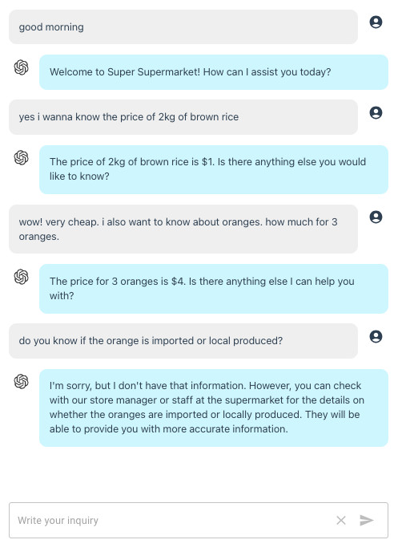

openai-api-function-call-sample
======

A sample app to demonstrate the newly added [function calling capabilities](https://openai.com/blog/function-calling-and-other-api-updates) in OpenAI Chat Completions API.

This application is built using manual setup of Next.js 13.

# Screenshot



# Function Call

Following the sample given in the [announcement page](https://openai.com/blog/function-calling-and-other-api-updates),
in this demo, we are simulating a **customer service chatbot for a supermarket**.

The `function call` will pertain to getting the price for product `get_product_price`:

```javascript
{
  "name": "get_product_price",
  "description": "Get the product price given the product and quantity",
  "parameters": {
    "type": "object",
    "properties": {
      "product": {
        "type": "array",
        "description": "The product names, e.g. Campbell's soup",
        "items": {
          "type": "string"
        }
      },
      "quantity": {
        "type": "array",
        "description": "The quantity, e.g. 1, 5, 37, 129",
        "items": {
          "type": "integer"
        }
      },
      "unit": {
          "type": "array",
          "description": "The unit, e.g. pcs, kg, bottle, bag, packs",
          "items": {
              "type": "string"
          }
      }
    },
    "required": ["product"]
  }
}
```

A sample response if inquiry from the user invokes the function:

```javascript
{
  role: 'assistant',
  content: null,
  function_call: {
    name: 'get_product_price',
    arguments: '{\n' +
      '  "product": ["brown rice", "pork belly", "garlic", "vinegar", "soy sauce"],\n' +
      '  "quantity": [2, 1, 3, 1, 1],\n' +
      '  "unit": ["kg", "kg", "heads", "bottle", "bottle"]\n' +
      '}'
  }
}
```


Otherwise, the response is like this:

```javascript
{
  role: 'assistant',
  content: 'Welcome to Super Supermarket! How can I assist you today?'
}
```

In this demo, I do not call any external API or function but just mock the step.

From `/api/route.js`

```javascript
// Mock Call function API here
//const price = 1 + Math.round(100 * Math.random())
//console.log('price', price)

const args = JSON.parse(result.function_call.arguments) // supports array

let func_result = args.product.map((a) => {
  return {
    name: a,
    price: 1 + Math.round(100 * Math.random()) // just mock
  }
})
```

will result to:

```javascript
{
  role: 'function',
  name: 'get_product_price',
  content: '[{"name":"brown rice","price":4},{"name":"pork belly","price":4},{"name":"garlic","price":5},{"name":"vinegar","price":22},{"name":"soy sauce","price":50}]'
}
```

From the given [sample in OpenAI's page](https://openai.com/blog/function-calling-and-other-api-updates),
we need to add the previous function call return plus the API return value to the `messages` array:

```javascript

// previous step
let messages = [
    { role: 'system', content: system },
]

messages = messages.concat(prev_data)
messages.push({ role: 'user', content: inquiry })

// first chat completion call
...

// add function call return
messages.push(result)

// add function API return
//messages.push({"role": "function", "name": "get_product_price", "content": JSON.stringify({ price })})

messages.push({"role": "function", "name": "get_product_price", "content": JSON.stringify(func_result)})
```

The expected result after this step is just simple response:

```javascript
{
  role: 'assistant',
  content: '...'
}
```

# Thinking Out Loud

Since sending too much data to the API cost money, I wonder what is the best way to implement `function call`.

In this demo, in the first API call, we do not know if the user inquiry will invoke `function call` so we are sending the system prompt and the previous conversation. If it does not contain `function call`, then we just pay a small price for the `function call` part.

However, if it does contain `function call`, then we send everything back again plus some more (function call and external API/function result). So, you can see that we double the tokens consumed.

The question is, would it be better to just check for `function call` first, without sending `previous conversations` and `system prompt`? If it failed, we just have the penalty of calling for the `function definition`. Is this approach better?


# Setup

Clone the repository and install the dependencies

```sh
git clone https://github.com/supershaneski/openai-api-function-call-sample.git myproject

cd myproject

npm install
```

Copy `.env.example` and rename it to `.env` then edit the `OPENAI_API_KEY` and use your own `OpenAI API key`.

```javascript
OPENAI_API_KEY=YOUR-OPENAI-API-KEY
```

Then run the app

```sh
npm run dev
```

Open your browser to `http://localhost:4000/` to load the application page.
