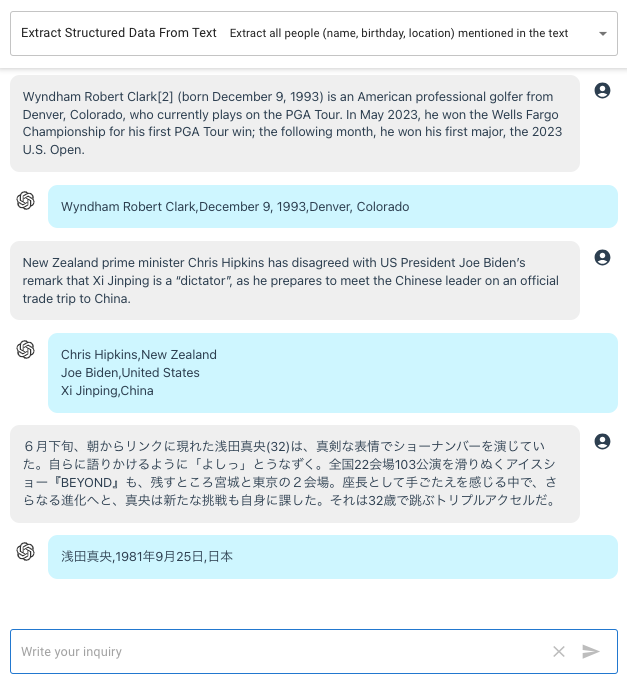

openai-api-function-call-sample
======

A sample app to demonstrate the newly added [function calling capabilities](https://openai.com/blog/function-calling-and-other-api-updates) in OpenAI Chat Completions API.

This application is built using manual setup of Next.js 13.

---

OpenAI Chat Completions APIで新たに追加された「ファンクションコール」機能を示すサンプルアプリ。

**Updates:**

* 2023-06-23: [Added Extracting Structured Data](#extracting-structured-data-from-text)
* 2023-06-19: [Added Multi-Function Calling](#mutiple-function-call)

# Screenshot


# Function Call 

Following the sample given in the [announcement page](https://openai.com/blog/function-calling-and-other-api-updates),
in this demo, we are simulating a **customer service chatbot for a supermarket**.

Here is the function definition for `get_product_price`:

```javascript
{
  name: 'get_product_price', 
  description: 'Get prices of the given products and its quantities', 
  parameters: {
    type: 'object', 
    properties: {
      products: {
        type: 'array', 
        items: {
          type: "object",
          properties: {
            name: { type: "string", description: "Name of product, e.g. banana, apple, spinach" },
            quantity: { type: "integer", description: "Quantity of product, e.g. 1, 2, 37" },
            unit: { type: "string", description: "Unit of quantity, e.g. kg, pcs, bottle, bag, packs" }
          }
        }
      }
    }, 
    required: ['products']
  }
}
```

Using this user inquiry:

`"i want to know how much is 2kg of brown rice, 1kg of pork belly, 3 heads of garlic, a 250ml bottle of vinegar and a 250ml bottle of soy sauce. i'm planning to cook adobo for dinner today."`

We will receive this sample response:

```javascript
{
  role: 'assistant',
  content: null,
  function_call: {
    name: 'get_product_price',
    arguments: '{\n' +
      '  "products": [\n' +
      '    {\n' +
      '      "name": "brown rice",\n' +
      '      "quantity": 2,\n' +
      '      "unit": "kg"\n' +
      '    },\n' +
      '    {\n' +
      '      "name": "pork belly",\n' +
      '      "quantity": 1,\n' +
      '      "unit": "kg"\n' +
      '    },\n' +
      '    {\n' +
      '      "name": "garlic",\n' +
      '      "quantity": 3,\n' +
      '      "unit": "heads"\n' +
      '    },\n' +
      '    {\n' +
      '      "name": "vinegar",\n' +
      '      "quantity": 250,\n' +
      '      "unit": "ml"\n' +
      '    },\n' +
      '    {\n' +
      '      "name": "soy sauce",\n' +
      '      "quantity": 250,\n' +
      '      "unit": "ml"\n' +
      '    }\n' +
      '  ]\n' +
      '}'
  }
}
```

A mock up API result will be like this:

```javascript
[
  { name: 'brown rice', quantity: 2, unit: 'kg', price: 91 },
  { name: 'pork belly', quantity: 1, unit: 'kg', price: 81 },
  { name: 'garlic', quantity: 3, unit: 'heads', price: 57 },
  { name: 'vinegar', quantity: 250, unit: 'ml', price: 2 },
  { name: 'soy sauce', quantity: 250, unit: 'ml', price: 13 }
]
```

Then put all together in the [final Chat API call](https://openai.com/blog/function-calling-and-other-api-updates) including actual system prompt and chat history.
However, if user inquiry does not invoke function call, we can get normal response.

```javascript
{ role: 'assistant', content: 'Hi there! How can I assist you today?' }
```

In this case, it is necessary to call the Chat Completions API again with actual system prompt and chat history to get proper response:

```javascript
{
  role: 'assistant',
  content: 'Welcome to Super Supermarket! How can I assist you today?'
}
```

# Mutiple Function Call


> Please note that this is just a sample. There is probably better implementation out there to achieve multiple-function calling.


See `api2/route.js` for reference.

Function definition

```javascript
{
  "name": "get_user_inquiry",
  "description": "Get users inquiry",
  "parameters": {
      "type": "object",
      "properties": {
          "location": {
              "type": "string",
              "description": "The city, place or any location" //, e.g. San Francisco, CA - removing to prevent hallucination
          },
          "date": {
              "type": "string",
              "description": "The date, e.g. 2023-06-19, today, tomorrow"
          },
          "operation": {
              "type": "array",
              "description": "Topic of inquiry, e.g. weather, event, hotels",
              "enum": ["weather", "event", "hotels"],
              "items": {
                  "type": "string"
              }
          }
      },
      "required": ["location", "date"]
  }
}
```

Sample response with multi-function

```javascript
{
  role: 'assistant',
  content: null,
  function_call: {
    name: 'get_user_inquiry',
    arguments: '{\n' +
      '  "location": "Tokyo",\n' +
      '  "date": "tomorrow",\n' +
      '  "operation": ["event", "weather"]\n' +
      '}'
  }
}
```

Sample response with single-function

```javascript
{
  role: 'assistant',
  content: null,
  function_call: {
    name: 'get_user_inquiry',
    arguments: '{\n  "location": "Tokyo",\n  "operation": ["hotels"]\n}'
  }
}
```

The Mock API return will be

```javascript
{
  event: 'Summer Festival, Yoyogi Park, 13:00PM - 21:00PM',
  weather: '25 degrees celsius Cloudy',
  location: 'Tokyo',
  date: 'tomorrow'
}
```

In the [OpenAI cookbook sample code](https://github.com/openai/openai-cookbook/blob/main/examples/How_to_call_functions_with_chat_models.ipynb), a `system prompt` is added to restrict the `function call` not to hallucinate when required parameters were not included. However, from my testing, I find not having such prompt seem better (of course, ymmv). To illustrate:

User prompt:

```
I want to know any upcoming events in Sapporo this Friday.
```

> Note: I asked this question on Tuesday, 2023-06-20

With `system prompt`:

```javascript
{
  role: 'assistant',
  content: null,
  function_call: {
    name: 'get_user_inquiry',
    arguments: '{\n' +
      '  "location": "Sapporo",\n' +
      '  "date": "this friday",\n' + 
      '  "operation": ["event"]\n' +
      '}'
  }
}
```

Without `system prompt`:

```javascript
{
  role: 'assistant',
  content: null,
  function_call: {
    name: 'get_user_inquiry',
    arguments: '{\n' +
      '  "location": "Sapporo",\n' +
      '  "date": "2023-06-23",\n' +
      '  "operation": ["event"]\n' +
      '}'
  }
}
```

> **Known Bug**: If you ask for anything without specifying the `location`, it might default to `San Francisco, CA`.

## Persistent Parameters

Consider this conversation,

```
User: What is happening in Sapporo tomorrow?

ChatGPT: The Summer festival will begin tomorrow at Odori Park.

User: How is the weather then?
```

A possible `function call` response will be,

```javascript
{
  role: 'assistant',
  content: null,
  function_call: {
    name: 'get_user_inquiry',
    arguments: '{\n  "location": "here",\n  "date": "today",\n  "operation": ["weather"]\n}'
  }
}
```

Depending on how you phrase the last inquiry, you'll either get a similar result above with wrong parameters, blank parameters or worst, `San Francisco, CA`, the sample we gave in the description.

One way to handle this is to store the previous parameters we received in some session variables.
In Next.js, I will be using [cookie](https://nextjs.org/docs/app/api-reference/functions/cookies).

```javascript
const cookieStore = cookies()

// retrieve stored parameters
const session_var = cookieStore.get('session-var')

...

// store the parameters
cookieStore.set('session-var', JSON.stringify({
    location,
    date,
}))
```

So before I send the parameters to the external API/function, I validate the parameters we received from function call and substitute the values from the stored parameters, if necessary.

Now, when we try the conversation again,

```
User: What is happening in Sapporo tomorrow?

ChatGPT: The Summer festival will begin tomorrow at Odori Park.

User: How is the weather then?

ChatGPT: Tomorrow in Sapporo, the weather is expected to be sunny with a temperature of around 23 degrees Celsius. It should be a pleasant day to enjoy outdoor events like the Summer Festival.
```

In case, the parameters are missing or invalid and there is no applicable stored parameters, we can just send an `error response`.

```javscript
{
  role: 'assistant',
  content: null,
  function_call: {
    name: 'get_user_inquiry',
    arguments: '{\n  "error": "Invalid parameters"\n}'
  }
}
```

The Chat Completions API will be able to process this and send back a clarifying response.
Refer to the sample conversation below.


# Extracting Structured Data From Text

One of the use case of `Function Calling` is [extracting structured data from text](https://openai.com/blog/function-calling-and-other-api-updates).

Using the function described in the OpenAI page `extract_people_data(people: [{name: string, birthday: string, location: string}])`, I write the definition:

```javascript
{
  name: "extract_people_data",
  description: "Extract all info related to people from the user's given text.",
  parameters: {
      type: "object",
      properties: {
          people: {
              type: "array",
              items: {
                  type: "object",
                  properties: {
                      name: { type: "string" },
                      birthday: { type: "string" },
                      location: { type: "string" },
                  }
              }
          }
      },
      required: ["people"]
  }
}
```

This function is supposed to be used for browsing Wikipedia but let us just use it to process the text submitted.

For example, using this input text,

```
New Zealand prime minister Chris Hipkins has disagreed with US President Joe Biden’s remark that Xi Jinping is a “dictator”, as he prepares to meet the Chinese leader on an official trade trip to China.
```

We will get a response from `function call`,

```javascript
{
  role: 'assistant',
  content: null,
  function_call: {
    name: 'extract_people_data',
    arguments: '{\n' +
      '  "people": [\n' +
      '    {\n' +
      '      "name": "Chris Hipkins",\n' +
      '      "birthday": "",\n' +
      '      "location": "New Zealand"\n' +
      '    },\n' +
      '    {\n' +
      '      "name": "Joe Biden",\n' +
      '      "birthday": "November 20, 1942",\n' +
      '      "location": "United States"\n' +
      '    },\n' +
      '    {\n' +
      '      "name": "Xi Jinping",\n' +
      '      "birthday": "June 15, 1953",\n' +
      '      "location": "China"\n' +
      '    }\n' +
      '  ]\n' +
      '}'
  }
}
```

The data for `birthday` and `location` is automatically filled since we have no `system prompt`. Depending on your use case, this behavior might be more desirable.


As the sample shown below, it can extract people from any language.




# Setup

Clone the repository and install the dependencies

```sh
git clone https://github.com/supershaneski/openai-api-function-call-sample.git myproject

cd myproject

npm install
```

Copy `.env.example` and rename it to `.env` then edit the `OPENAI_API_KEY` and use your own `OpenAI API key`.

```javascript
OPENAI_API_KEY=YOUR-OPENAI-API-KEY
```

Then run the app

```sh
npm run dev
```

Open your browser to `http://localhost:4000/` to load the application page.
